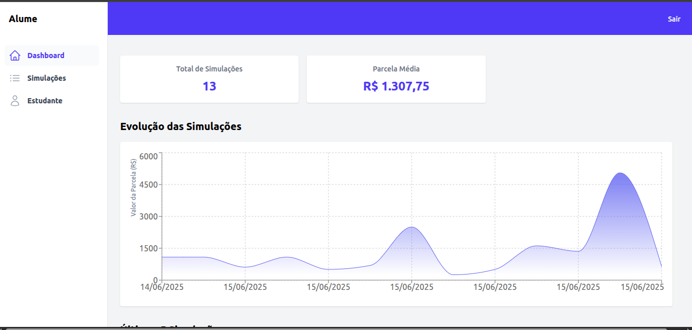
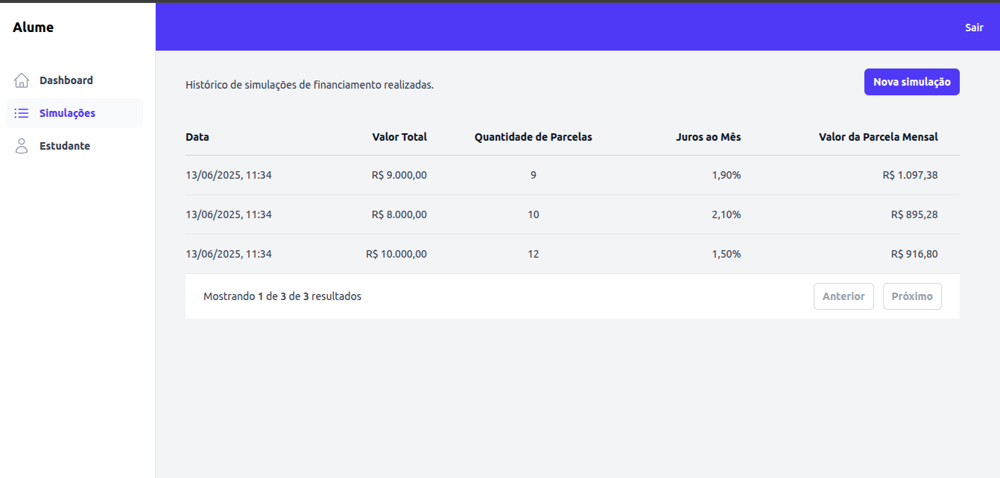
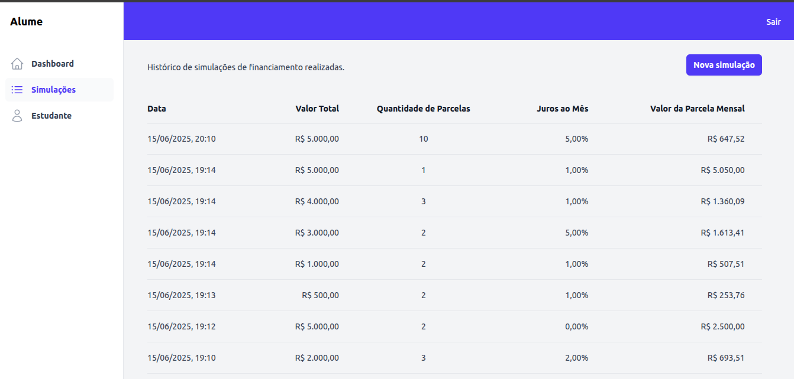
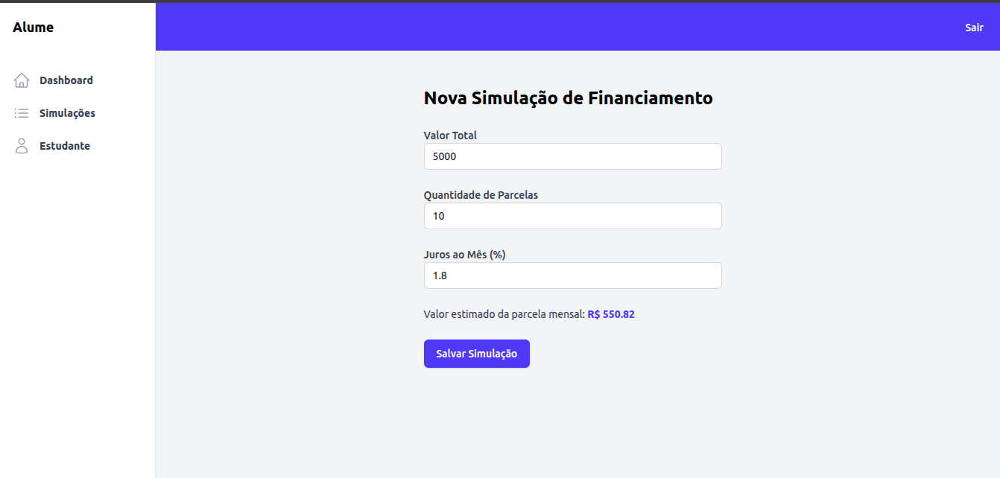

# Projeto de Simulações Financeiras

Este projeto consiste em uma aplicação web para cadastro e gerenciamento de simulações financeiras, com backend em Fastify e frontend em React.

## Tecnologias Utilizadas

### Backend


PostgreSQL - Banco de dados relacional robusto e escalável


Prisma ORM - ORM para modelagem e acesso ao banco


Fastify - Framework Node.js rápido e eficiente para APIs REST

### Frontend


React - Biblioteca para construção da interface do usuário


Vite - Bundler e dev server rápido para React


Tailwind CSS - Framework CSS utilitário para estilização

📊 Recharts - Biblioteca para criação de gráficos<br/>
🧩 React Hook Form - Gerenciamento simples e performático de formulários<br/>
✔️ Yup - Validação de dados e esquemas

### Gerenciamento de Pacotes e Workspaces


- 📦 PNPM - Gerenciador de pacotes eficiente com suporte a workspaces

```bash
npm install -g pnpm@latest-10
```

## Estrutura do Projeto

- `/api` - Backend construído com Fastify e Prisma
- `/app` - Frontend construído com React, Vite, Tailwind CSS, React Hook Form e Recharts

## 🛠️ Como Rodar o Projeto

Siga os passos abaixo para executar o projeto localmente:

### 1. Clone o repositório

```bash
git clone git@github.com:FelipeBuso/teste-tecnico-alume.git
cd teste-tecnico-alume
```

### 2. Instale as dependências

```bash
pnpm install
```

### 3. Suba o banco de dados PostgreSQL.

```bash
docker compose up -d
```

Isso criará e executará um container com PostgreSQL.

### 4. Gere o Prisma Client

```bash
pnpm --filter api run generate
```

### 5. Execute as migrações no banco de dados

```bash
pnpm --filter api run migrate
```

Esse comando criará as tabelas no banco com base no schema do Prisma.

### 6. (Opcional) Execute a seed para dados de teste

```bash
pnpm --filter api run seed
```

Esse comando irá popular o banco com dados fictícios úteis para testes.

### 7. Inicie os serviços

#### Backend (API)

```bash
pnpm --filter api run dev
```

#### Frontend (App)

```bash
pnpm --filter app run dev
```

#### Ambos

```bash
pnpm run dev
```

## 🚧 Melhorias Futuras

- ✅ Implementar testes unitários e de integração na API (Fastify + Prisma)
- ✅ Adicionar testes automatizados no frontend com ferramentas como:
  - Vitest / Jest
  - Testing Library
  - Cypress (para testes end-to-end)
- ✅ Implementar refresh token (atualmente só relogin)
- ✅ Melhorar tratamento de erros e notificações no front
- ✅ Validação mais robusta nos formulários
- ✅ Responsividade e acessibilidade aprimoradas na interface

### Screenshots





